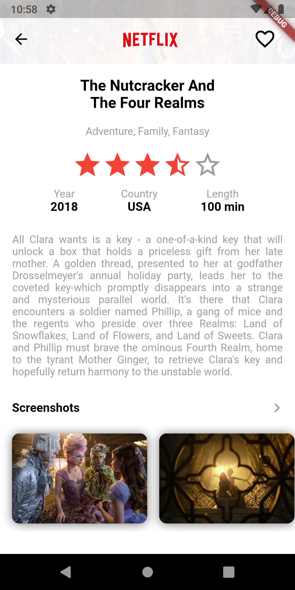

# movieapp

A Flutter movie application.\
The repository demonstrate use of PageController, AnimationBuilder (Animation for page view),\
shared transaction using Hero.\
How to create custom clipper (Created CustomOvalClipper)\
Creating custom shadow for image, solution found on below link\
- [Link for ClipShadowPath](https://gist.github.com/multiarts/6d732a5a99278ce359bbf16c005f7c85 )

 

## App Screenshot (iOS)

  
  

## App Screenshot (Android)

  
  
  

